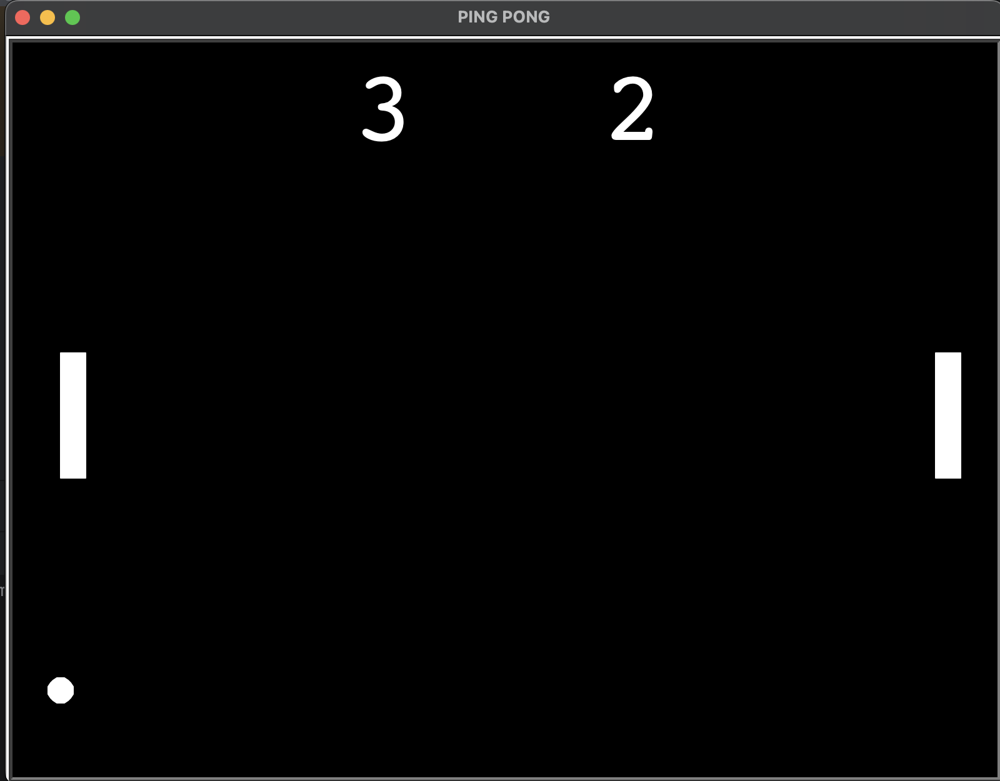

# Ping Pong Game 🏓

This is a simple Ping Pong game built using Python's Turtle Graphics library. The game features two paddles controlled by keyboard input, a moving ball, and a scoring system that tracks the players' scores. The first player to reach 5 points wins the game.

## Features

- **Single or Multiplayer**: Control paddles with separate keys, allowing two players to play on the same device.
- **Score Tracking**: Keeps track of the score for each player and displays the winner once a score of 5 is reached.
- **Collision Detection**: Handles ball bouncing off the walls and paddles for realistic gameplay.

## Installation

To play this game, ensure Python is installed on your system.

1. Clone the repository:
   ```bash
   git clone https://github.com/your-username/ping-pong-game.git
   ```
   
2. Navigate to the project directory:
   ```bash
   cd ping-pong-game
   ```
   
3. Run the game:
   ```bash
   python main.py
   ```

## How to Play

- **Controls**:
  - **Right Paddle**: Use the `Up` and `Down` arrow keys to move.
  - **Left Paddle**: Use the `A` key to move up and `Z` to move down.

- **Objective**: The goal is to bounce the ball back and forth without letting it pass your paddle. If the ball goes past a paddle, the opposing player scores a point.

- **Winning the Game**: The first player to reach 5 points wins. A message will display indicating the winner.

## Code Overview

- **Screen Setup**: Sets up a black background with an 800x600 resolution for the game area.
- **Paddle and Ball Classes**: 
  - **Paddle**: Represents the paddles controlled by each player.
  - **Ball**: Manages the movement and bouncing behavior of the ball.
- **ScoreBoard Class**: Keeps track of the players' scores and updates them on the screen.
- **Game Loop**: Continuously updates the screen and checks for collisions with the paddles and walls, as well as if a player scores.

## Example Gameplay



## License

This project is open-source and available under the [MIT License](LICENSE).
